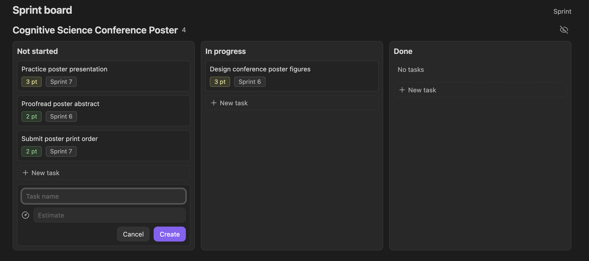
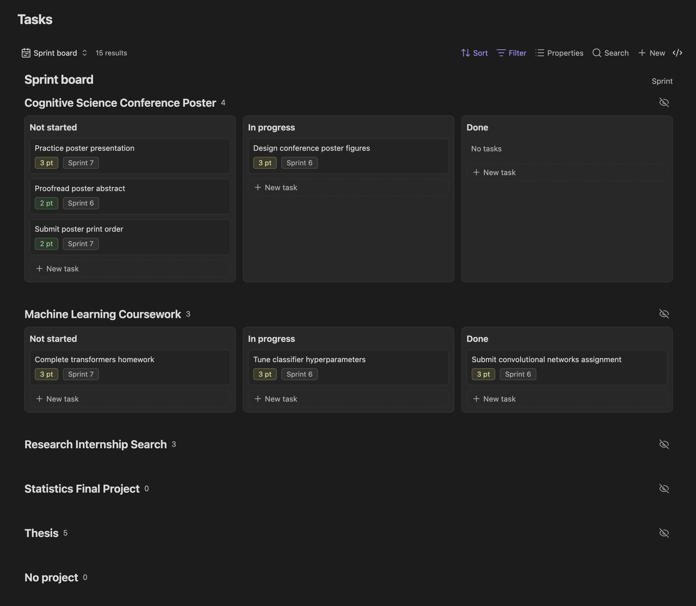
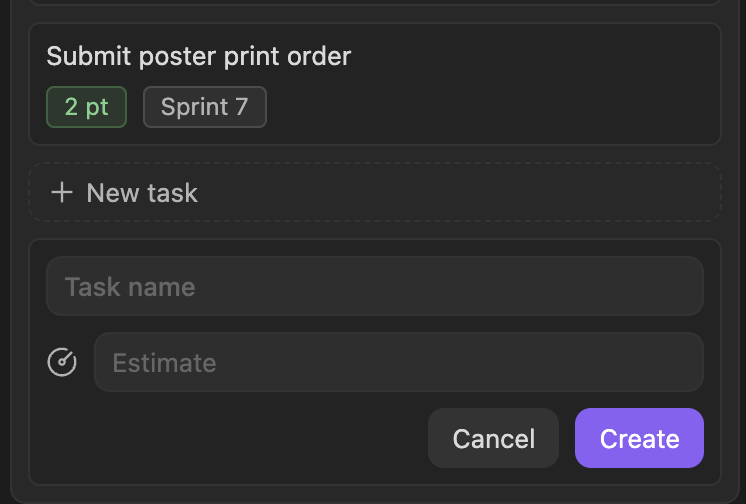
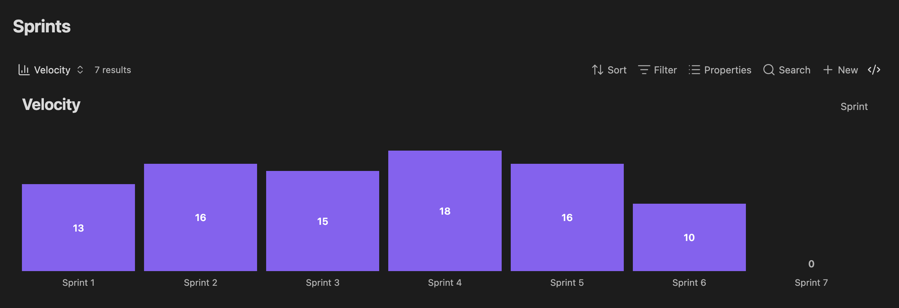
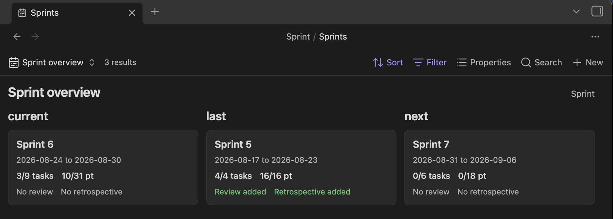

# Sprint

[English](README.md) | [日本語](README_ja.md)

Sprint adds automatic sprint planning and project-based Kanban boards to Obsidian. It creates sprint notes on a configurable cadence, rolls unfinished work forward, and provides task, sprint, velocity, and project views using Obsidian Bases.

Sprint also works with AI coding agents. It can install local skills that teach Claude Code and compatible agents how to create and manage projects, tasks, and sprints using the generated workspace structure.



## Features

- Automatic current and future sprint generation on a 1-8 week cadence.
- Catch-up generation after Obsidian has been closed for one or more sprint cycles.
- Configurable rollover of unfinished tasks to the current sprint, backlog, or original sprint.
- Project-grouped Kanban boards for all, current, and next-sprint tasks.
- Drag-and-drop task state changes and inline task creation.
- Collapsible and hideable project sections.
- Configurable task-card and new-task properties.
- Task archiving without deleting the underlying notes.
- Sprint overview cards with dates, completed tasks, completed points, reviews, and retrospectives.
- A dependency-free velocity bar chart.
- A generated Sprint Summary and an **Open Sprint Summary** command.
- Optional vault-local skills for Claude Code and agents that support the Agent Skills convention.

## Screenshots

### Plan work by project

The full Sprint board groups tasks by project and separates Not started, In progress, and Done work. Cards can show estimates, sprint assignments, and other configured properties.



### Create tasks from the board

Each project and state column includes a **New task** action. New tasks inherit the selected project, sprint scope, and state, and can include configurable properties such as Estimate.



### Track velocity

The dependency-free Velocity view charts completed story points for every generated sprint, including sprints with zero completed points.



### Review active sprints

Sprint overview cards show the last, current, and next sprint with dates, completed tasks, completed points, and review status.



## Requirements

- Obsidian 1.13.0 or later.
- The Obsidian Bases core plugin enabled.

## Installation

In Obsidian, open **Settings -> Community plugins -> Browse**, search for **Sprint** by **shijimi-soup**, then install and enable it. In the welcome prompt, select **Set up Sprint** and confirm the workspace creation.

For screenshots and the complete first-time setup, see the [English installation guide](docs/INSTALLATION.md) or [Japanese installation guide](docs/INSTALLATION_ja.md).

### Community Plugins

1. Open **Settings -> Community plugins**.
2. Select **Browse** and search for **Sprint**.
3. Select the plugin by **shijimi-soup**, then install and enable it.

### Manual Installation

1. Open the [latest Sprint release](https://github.com/ShijiMi-Soup/Sprint/releases/latest).
2. Under **Assets**, download `main.js`, `manifest.json`, and `styles.css`. Do not download the **Source code** archives; they are not installable plugin packages.
3. In the target vault, create `.obsidian/plugins/sprint/` if it does not already exist. The `.obsidian` directory may be hidden by your operating system.
4. Place the three downloaded files directly inside the `sprint` directory:

   ```text
   <vault>/
   └── .obsidian/
       └── plugins/
           └── sprint/
               ├── main.js
               ├── manifest.json
               └── styles.css
   ```

5. Restart Obsidian, or run **Reload app without saving** from the command palette.
6. Open **Settings → Community plugins**, find Sprint under the installed plugins, and enable it. If Community plugins are disabled, turn off Restricted mode first.

## Getting Started

1. Open **Settings -> Sprint**.
2. Review the Sprint folder, cadence anchor, duration, start day, and rollover settings.
3. If you skipped the first-run setup, turn on **Automatic sprints** and confirm the file-creation warning.
4. Open the command palette and run **Open Sprint Summary**.

The first initialization creates tutorial projects and tasks to demonstrate the workflow. They are created only once. Deleting them later does not cause them to reappear on startup.

The default vault layout is:

```text
Vault root/
├── .agents/skills/sprint/SKILL.md
├── .claude/skills/sprint/SKILL.md
└── Sprint/
    ├── Tasks.base
    ├── Sprints.base
    ├── Projects.base
    ├── Projects/
    ├── Tasks/
    ├── Sprints/
    ├── AGENTS.md
    ├── CLAUDE.md
    └── Sprint Summary.md
```

## Using Sprint

### Task States

Sprint derives three task states from two checkbox properties:

| State | `in progress` | `is done` |
| --- | --- | --- |
| Not started | `false` | `false` |
| In progress | `true` | `false` |
| Done | Either value | `true` |

Dragging a card between Kanban columns updates these properties. Checking `archived` removes a task from sprint boards while keeping it in the Tasks table and vault.

### Project Visibility

Projects can be collapsed or hidden from sprint boards. Hidden projects remain available under the board's **Hidden** section. Current and next sprint boards show only projects in progress; the full Sprint board also shows projects that are not started or done.

### Generated Files and Migrations

Sprint creates missing support files during first-time setup and applies versioned, additive migrations when its managed schema changes. Existing task and project notes are not reset during normal startup. Custom Base views, properties, and unknown view settings are preserved.

Changing the Sprint folder through the rename action moves the existing workspace and updates configured Base paths. **Reset Sprint workspace** is destructive and requires typing `Yes, delete.` before Sprint deletes and recreates the configured folder.

## AI Skills

Sprint installs its own skill at `.agents/skills/sprint/SKILL.md` and `.claude/skills/sprint/SKILL.md` in the vault root. Existing folders, unrelated skills, and unmanaged files are preserved.

Sprint also creates managed `AGENTS.md` and `CLAUDE.md` files inside the Sprint workspace. Creating corresponding instruction files at the vault root is optional and disabled by default because a vault may already contain user-managed instructions. The generated skill and vault-specific additions can be reviewed and edited from Sprint settings.

Sprint does not send vault content over the network or invoke an AI model. External AI tools run independently and have their own permissions and privacy behavior.

## Commands

- **Sprint: Open Sprint Summary** opens the generated dashboard.
- **Sprint: Sync sprints** creates missing sprint notes, updates lifecycle states, and applies rollover rules.
- **Sprint: Generate sprint Bases** creates missing support files and applies managed Base schema updates.

## Development

```bash
npm install
npm run check
```

The production build creates the standalone `main.js` and `styles.css` files and an embeddable ESM module under `dist/`.

```text
src/domain/        Scheduling, workspace settings, rollover, and contracts
src/obsidian/      Vault, Bases, settings, and storage adapters
src/SprintFeature  Embeddable lifecycle and public API
src/main.ts        Standalone plugin entry point
```

`src/domain/` is independent of Obsidian and AI integrations. See [docs/AGENT_GUIDE.md](docs/AGENT_GUIDE.md) for the rules exposed to optional external agents and [docs/DEVLOG.md](docs/DEVLOG.md) for development history.

## License

[MIT](LICENSE) Copyright 2026 Shijimi.
