# Installation Guide

[English](INSTALLATION.md) | [日本語](INSTALLATION_ja.md)

This guide walks through installing Sprint from Obsidian Community plugins and creating your first Sprint workspace. The screenshots were taken with Sprint 0.1.2; the same steps apply to 0.1.3.

## Requirements

- Obsidian 1.13.0 or later
- The Obsidian **Bases** core plugin enabled
- Community plugins enabled for the vault

## Install Sprint

1. Open the vault where you want to use Sprint. Select the settings icon in the lower-left corner.

   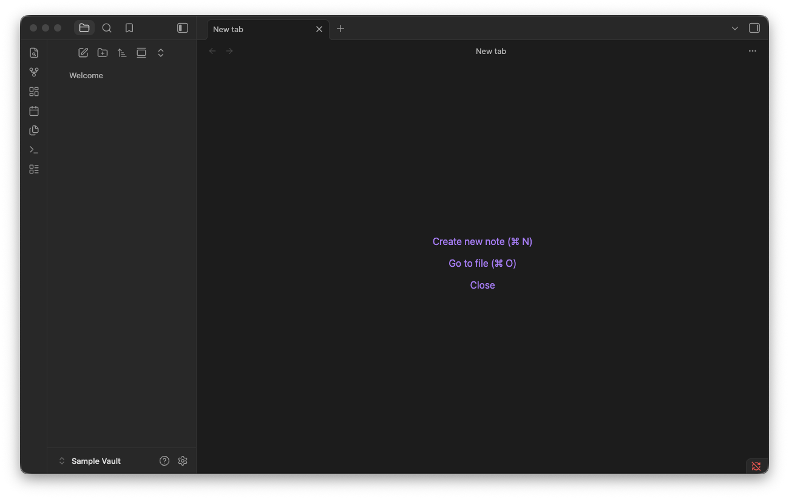

2. Open **Community plugins**, select **Browse**, and search for **Sprint**. Choose the plugin published by **shijimi-soup**, then select **Install**.

   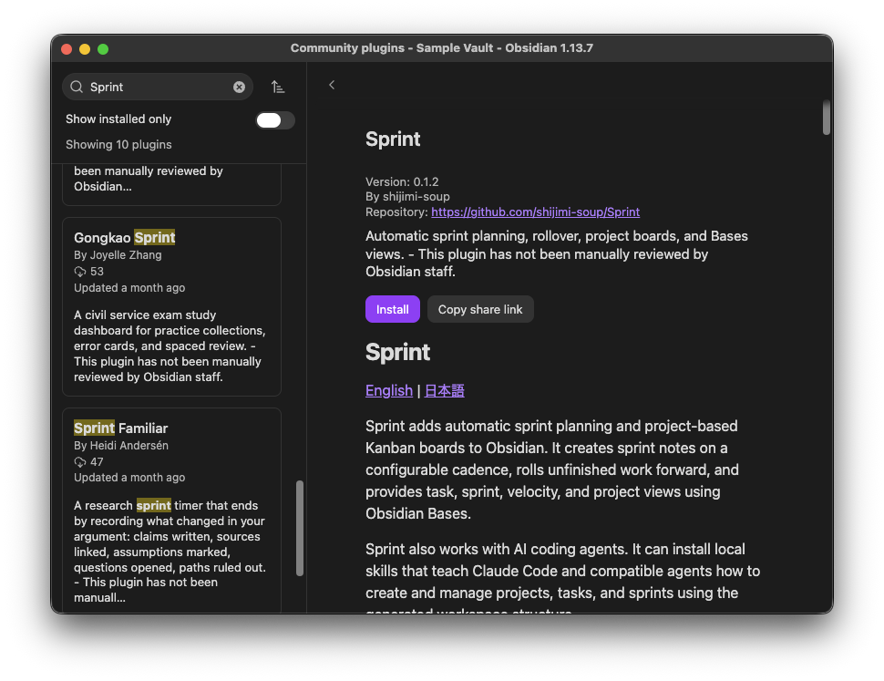

3. After installation finishes, select **Enable**.

   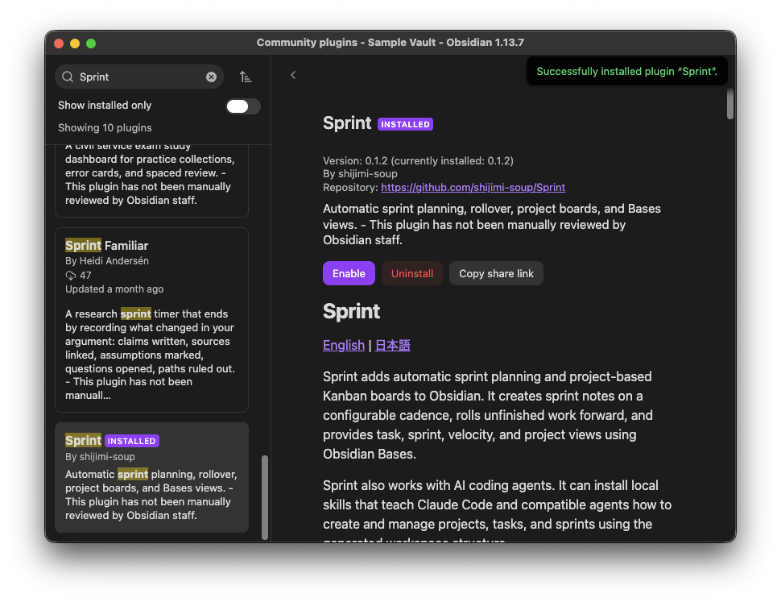

4. Select **Options** to open Sprint's settings.

   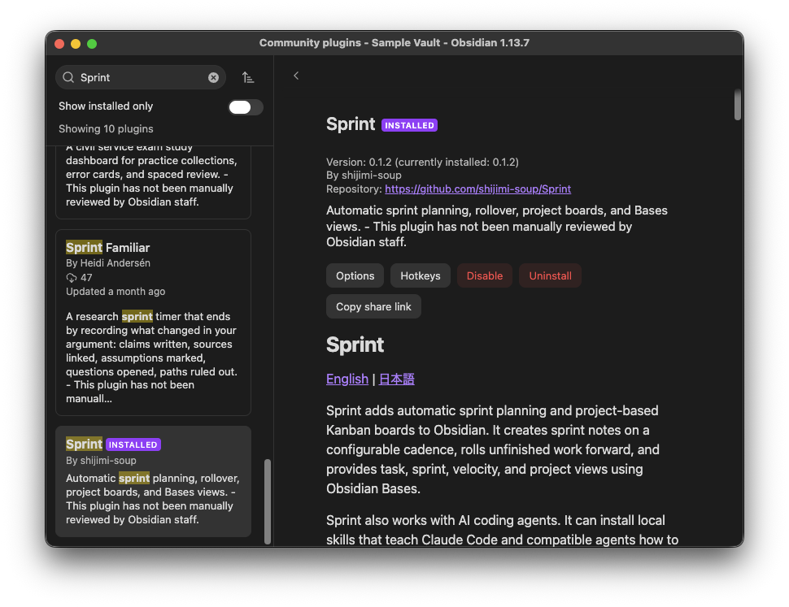

## Create The Sprint Workspace

5. Review the defaults before creating files. You can configure the sprint duration, start day, incomplete-task behavior, number of future sprints, naming pattern, and workspace location.

   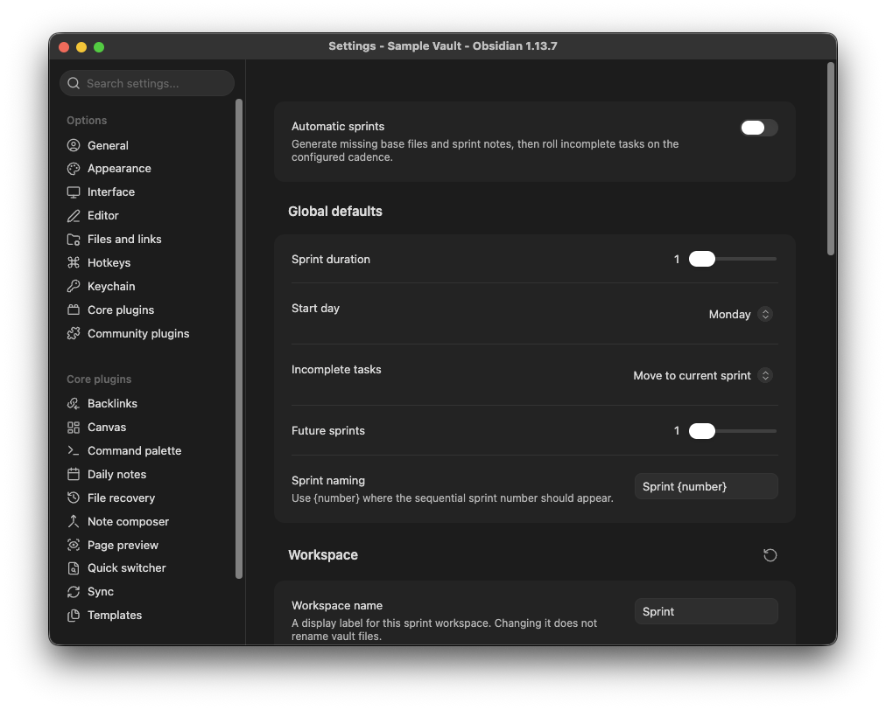

6. Turn on **Automatic sprints**. Sprint shows a confirmation dialog describing the files it will create. Select **Turn on** to continue.

   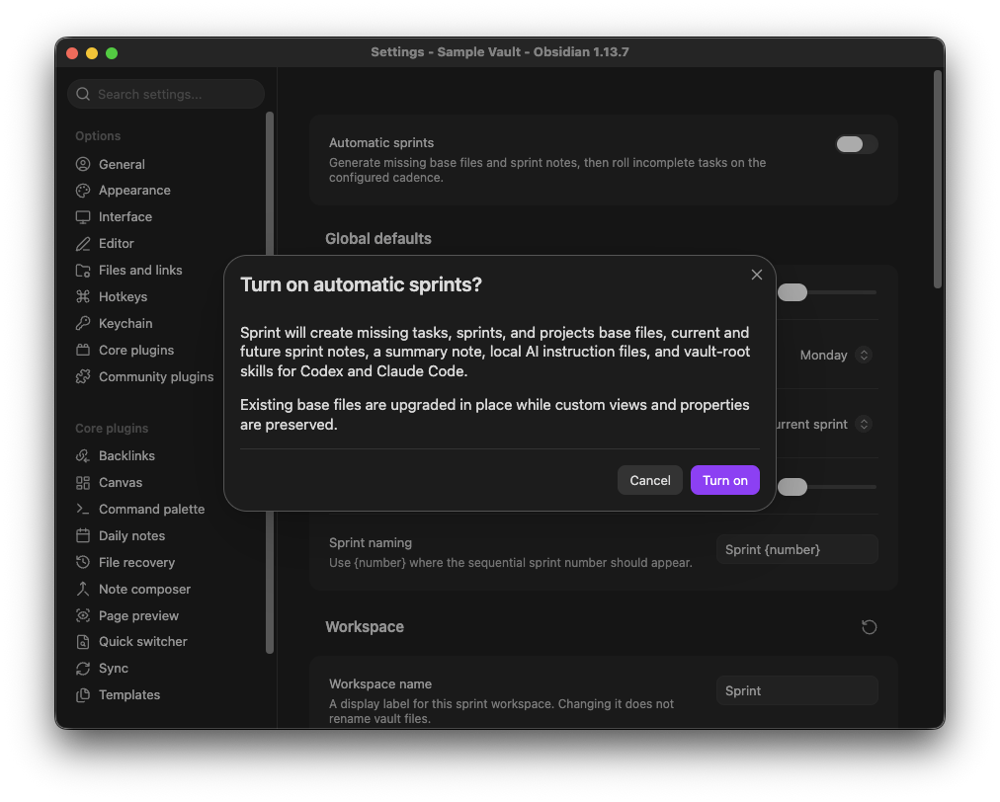

7. Wait for the synchronization notice. It reports how many sprint notes were created and how many tasks were moved.

   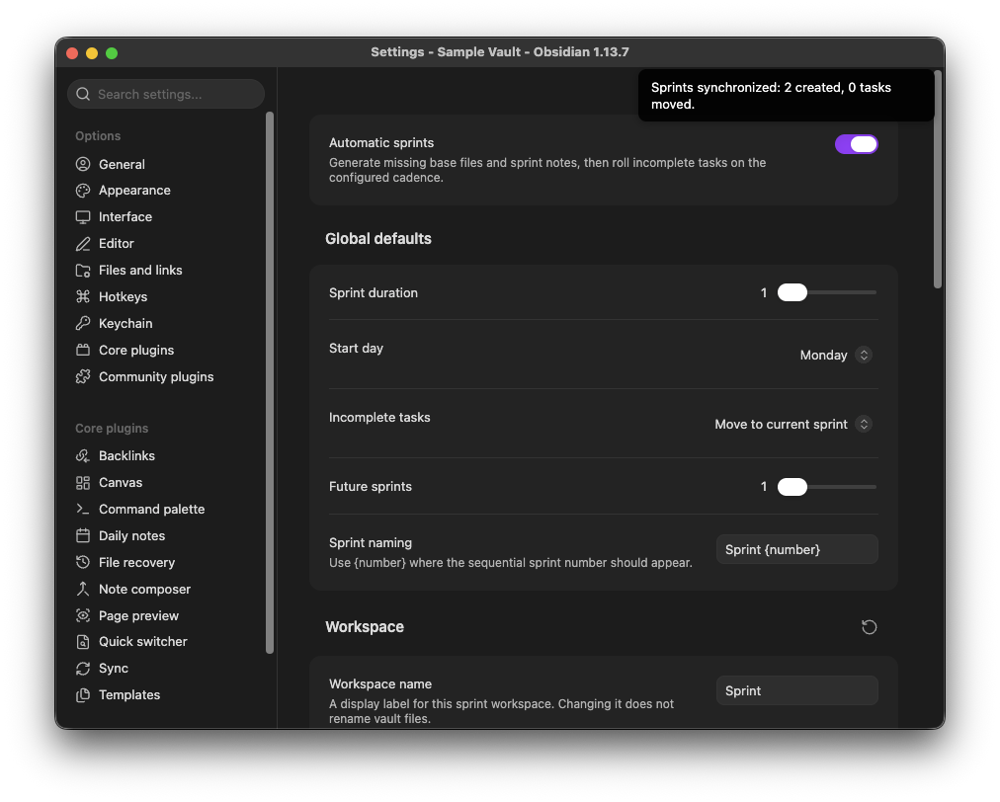

Sprint creates missing workspace files without replacing an existing Sprint workspace. Reinstalling the plugin does not recreate tutorial projects or tasks when the configured workspace folder already exists. The separate **Reset workspace** action is destructive and requires explicit confirmation.

## Check The Result

8. Return to the file explorer. The default `Sprint` folder contains task, sprint, and project folders; three Bases files; a Sprint Summary; and local AI instruction files.

   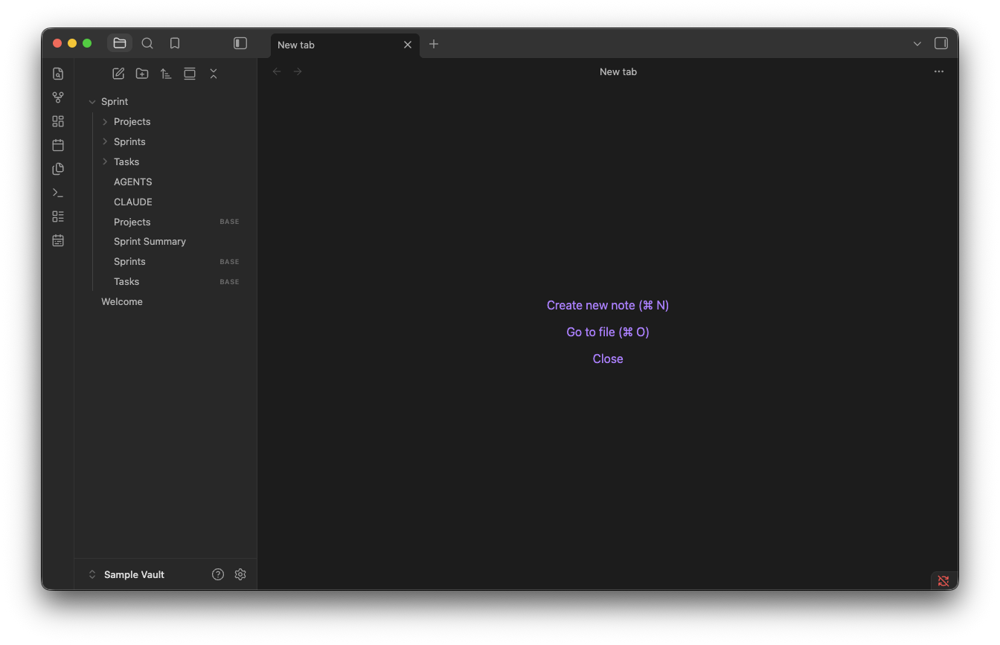

   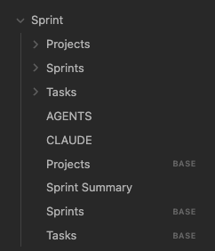

9. Open `Sprint/Sprint Summary.md`, or run **Open Sprint Summary** from the command palette. The Current Tasks section shows the current-sprint Kanban board grouped by project.

   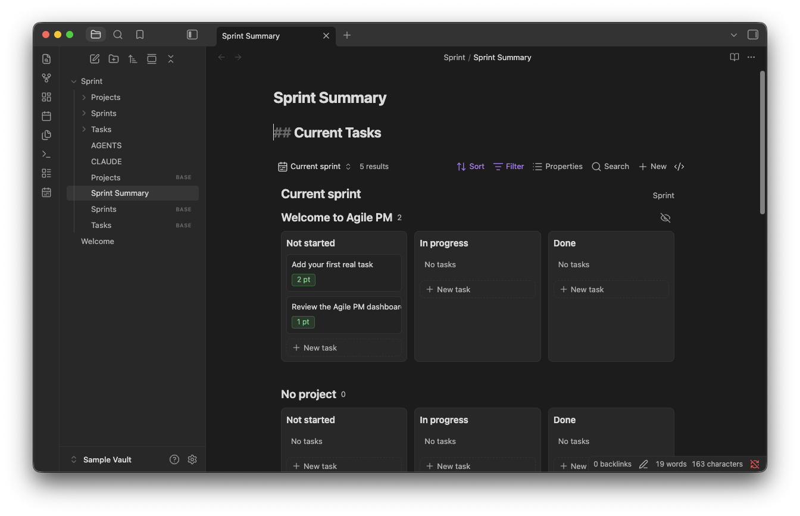

10. Scroll down to review completed points in the Velocity chart and the current project list.

    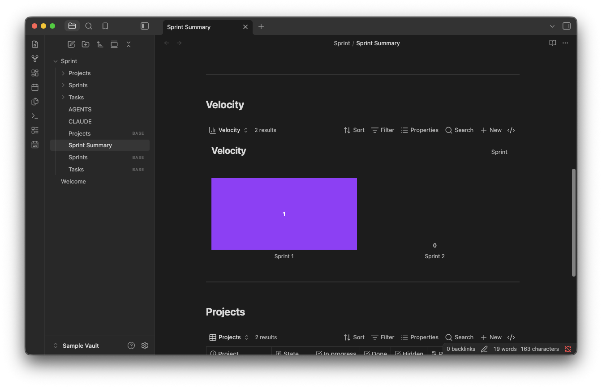

    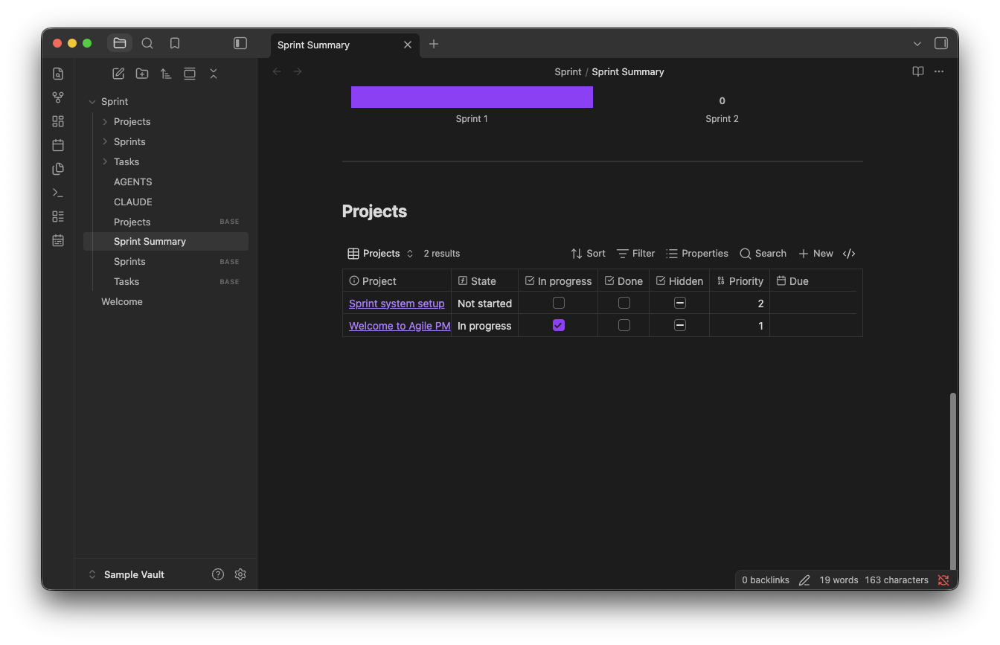

## Manual Installation

If Sprint is unavailable in the Community plugins browser:

1. Open the [latest Sprint release](https://github.com/ShijiMi-Soup/Sprint/releases/latest).
2. Download `main.js`, `manifest.json`, and `styles.css` from **Assets**. Do not use the source-code archives.
3. Create `<vault>/.obsidian/plugins/sprint/` and place all three files directly inside it.
4. Restart Obsidian, or run **Reload app without saving** from the command palette.
5. Open **Settings -> Community plugins** and enable Sprint.

## Troubleshooting

- **Sprint does not appear in Community plugins:** Update Obsidian, close and reopen the Community plugins browser, then search again.
- **No workspace files appear:** Open **Settings -> Sprint** and make sure **Automatic sprints** is enabled.
- **The board does not render:** Open **Settings -> Core plugins** and enable **Bases**.
- **You installed files manually but Sprint is missing:** Confirm that `main.js`, `manifest.json`, and `styles.css` are directly inside `.obsidian/plugins/sprint/`, then reload Obsidian.

