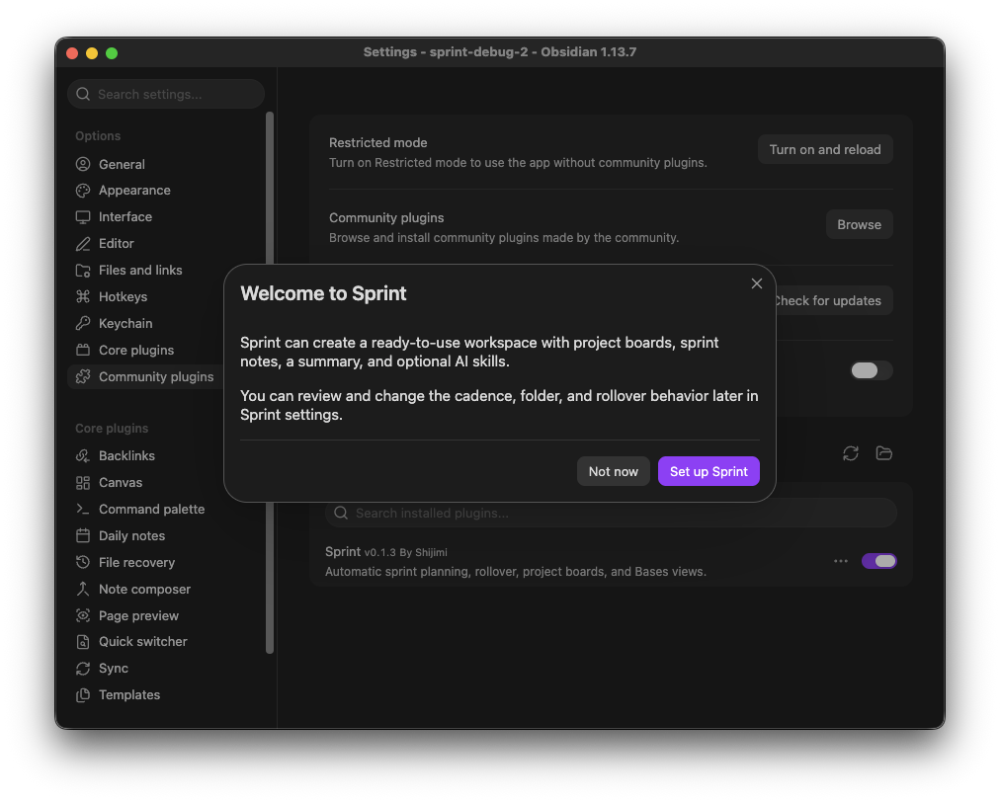
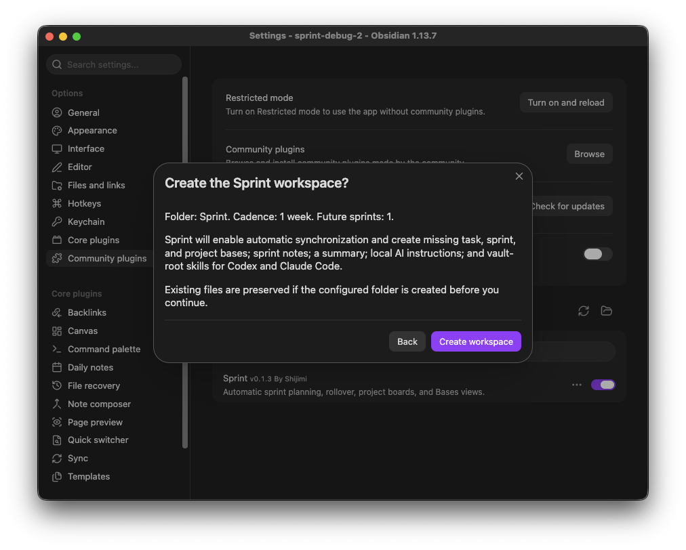
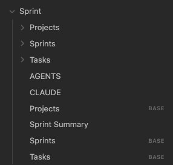
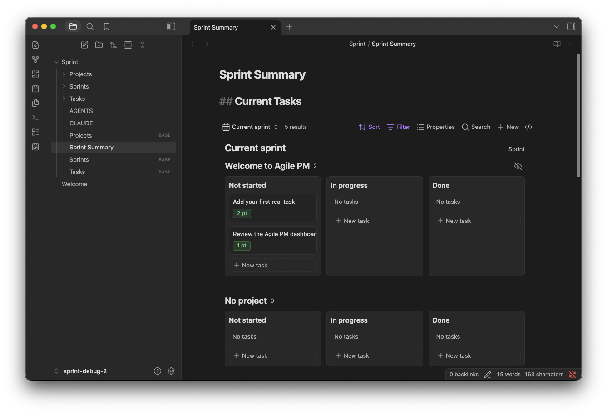
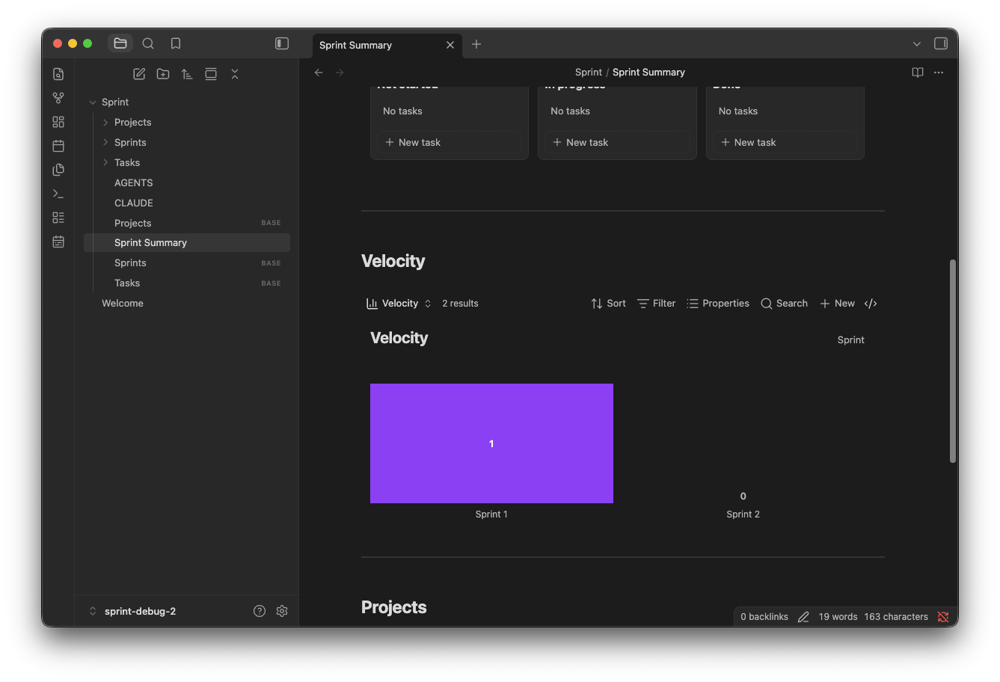
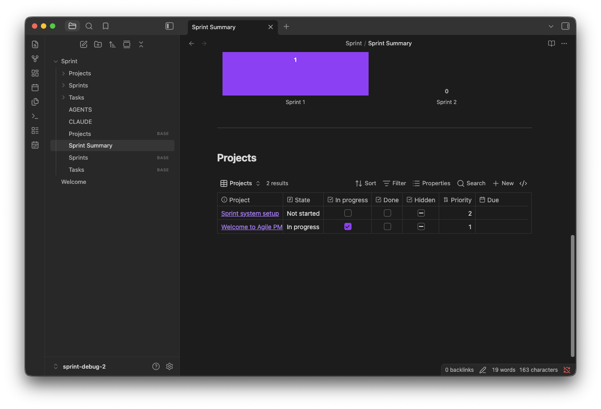
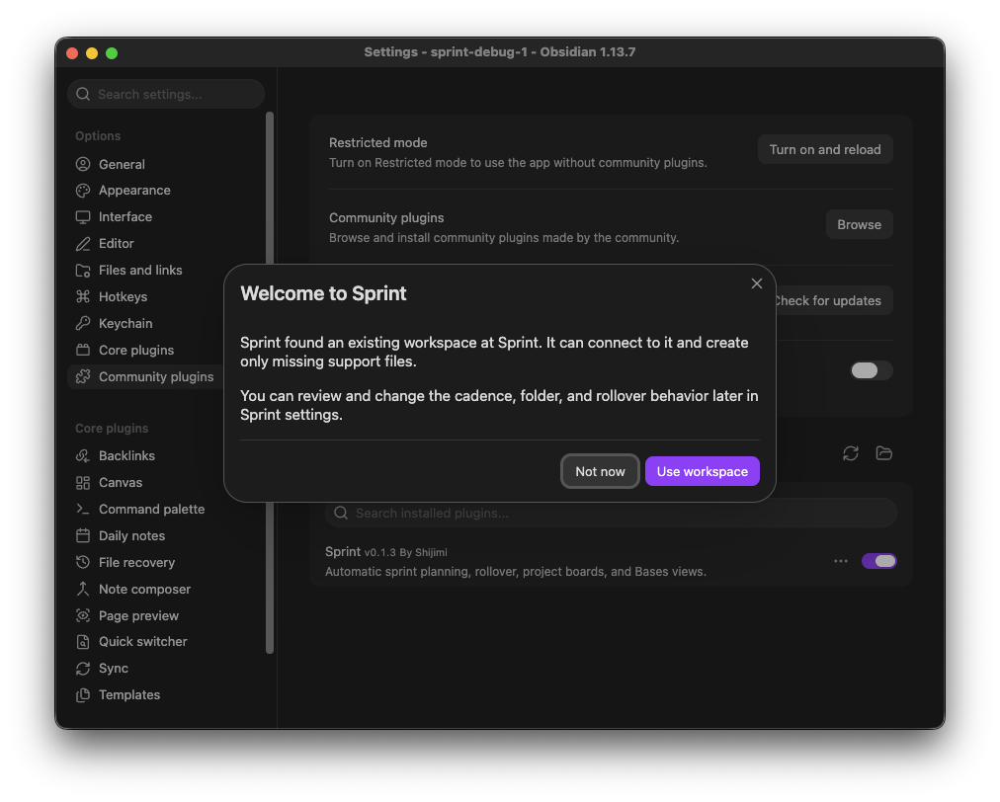
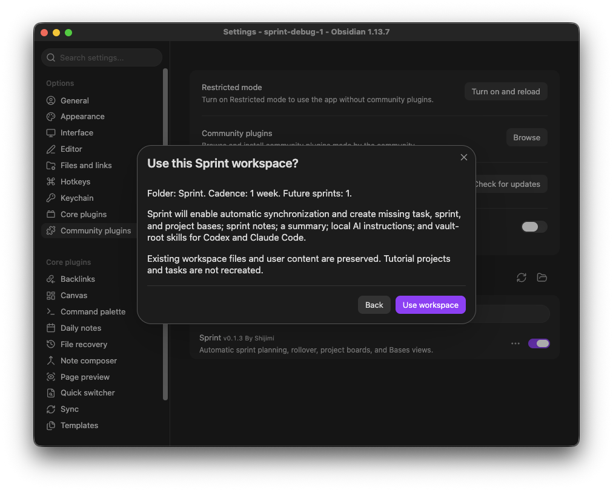

# インストールガイド

[English](INSTALLATION.md) | [日本語](INSTALLATION_ja.md)

このガイドでは、ObsidianのコミュニティプラグインからSprint 0.1.3をインストールし、新しいSprintワークスペースを作成する手順と、既存ワークスペースへ再接続する手順を説明します。

## 必要環境

- Obsidian 1.13.0以降
- Obsidianのコアプラグイン**Bases**が有効であること
- 対象Vaultでコミュニティプラグインが有効であること

## 新規インストール

1. Sprintを使用するVaultを開き、左下の設定アイコンを選択します。

   

2. **コミュニティプラグイン**を開き、**閲覧**を選択して**Sprint**を検索します。作者が**shijimi-soup**のプラグインを開き、**Install**を選択します。

   

3. インストールが完了したら、**Enable**を選択します。

   

4. Sprintの初期設定画面が表示されます。**Set up Sprint**を選択します。

   

5. フォルダ、スプリント周期、将来のスプリント数を確認します。**Create workspace**を選択すると、自動同期が有効になり、必要なファイルが作成されます。

   

   ファイルを作成しない場合は**Not now**を選択します。後から**設定 -> Sprint -> Setup guide**を開いてセットアップを再開できます。

## ワークスペースを確認する

セットアップが完了すると、デフォルトの`Sprint`フォルダに、タスク、スプリント、プロジェクトの各フォルダ、3つのBasesファイル、AI向けのローカル指示、`Sprint Summary.md`が作成されます。



`Sprint/Sprint Summary.md`を開くか、コマンドパレットから**Open Sprint Summary**を実行します。最初のセクションには、現在のスプリントのタスクがプロジェクト別、状態別に表示されます。



下へスクロールすると、Velocityグラフで完了したストーリーポイントを確認し、Projectsテーブルでプロジェクトを管理できます。





## 既存のSprintワークスペース

設定先に`Sprint`フォルダがすでに存在し、プラグインに保存済みの設定がない場合、初期設定画面には新規作成ではなく**Use workspace**が表示されます。



検出されたフォルダを確認し、**Use workspace**を選択します。Sprintは不足しているサポートファイルとスプリントノートだけを作成します。既存の内容は保持され、チュートリアル用のプロジェクトやタスクは再作成されません。



Sprintを再インストールまたは更新しても、スプリント番号はリセットされず、既存ワークスペースは上書きされません。別に用意されている**Reset workspace**設定は破壊的な操作で、実行には明示的な確認が必要です。

## 作成されるファイル

デフォルトのワークスペース構成は次のとおりです。

```text
Vault root/
├── .agents/skills/sprint/SKILL.md
├── .claude/skills/sprint/SKILL.md
└── Sprint/
    ├── Tasks.base
    ├── Sprints.base
    ├── Projects.base
    ├── Projects/
    ├── Tasks/
    ├── Sprints/
    ├── AGENTS.md
    ├── CLAUDE.md
    └── Sprint Summary.md
```

## 手動インストール

コミュニティプラグインの一覧からSprintをインストールできない場合は、次の手順を使用します。

1. [Sprintの最新リリース](https://github.com/ShijiMi-Soup/Sprint/releases/latest)を開きます。
2. **Assets**から`main.js`、`manifest.json`、`styles.css`をダウンロードします。ソースコードのアーカイブは使用しません。
3. `<Vault>/.obsidian/plugins/sprint/`を作成し、3つのファイルをすべてその直下に配置します。
4. Obsidianを再起動するか、コマンドパレットから**Reload app without saving**を実行します。
5. **設定 -> コミュニティプラグイン**を開き、Sprintを有効にします。
6. 初期設定画面に従って、ワークスペースの新規作成または再接続を行います。

## トラブルシューティング

- **初期設定画面が表示されない:** **設定 -> Sprint -> Setup guide**を開いてください。
- **ワークスペースファイルが作成されない:** **設定 -> Sprint**を開き、**Automatic sprints**が有効になっていることを確認してください。
- **ボードが表示されない:** **設定 -> コアプラグイン**を開き、**Bases**を有効にしてください。
- **手動インストール後にSprintが表示されない:** `main.js`、`manifest.json`、`styles.css`が`.obsidian/plugins/sprint/`の直下にあることを確認し、Obsidianを再読み込みしてください。
